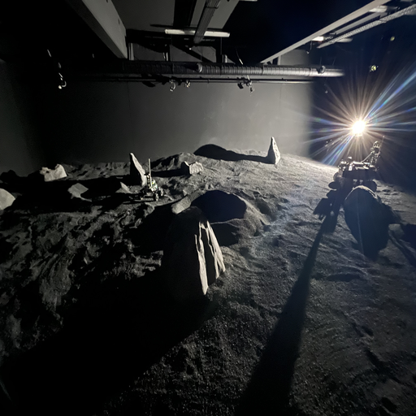
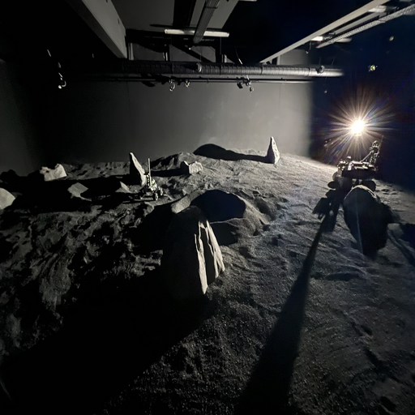

# Flare Removal for Lunar Rovers

This project is a modification and application of the [Flare7K](https://github.com/ykdai/Flare7K.git) repository, tailored for flare removal in images captured by lunar rovers. The steps below guide you through setting up the environment and running the model on your own image data.

## Table of Contents

- [Installation](#installation)
- [Usage](#usage)
  - [Preparing Your Data](#preparing-your-data)
  - [Running the Model](#running-the-model)
- [Usage on Jetson Nano Orin](#usage-on-jetson-nano-orin)

## Installation

1. **Clone the repository**:

   ```bash
   git clone https://github.com/ykdai/Flare7K.git
2. **Navigate to the project directory**:

   ```bash
   cd Flare7K
3. **Set up a Python virtual environment**:

   It’s recommended to use `python3-venv` for creating a virtual environment:

   ```bash
   python3 -m venv venv

4. **Activate the virtual environment**:

   Once the virtual environment is created, you need to activate it.

   On **Linux/Mac**:

   ```bash
   source venv/bin/activate
5. **Install the required dependencies**:

   With the virtual environment activated, install the necessary Python packages specified in the `requirements.txt` file:

   ```bash
   pip install -r requirements.txt

6. **Set up the project**:

   Install the project in development mode using the following command:

   ```bash
   python setup.py develop
## Usage

### Preparing Your Data

1. **Create an input data directory**:

   To organize your input images, create a directory called `input_data`:

   ```bash
   mkdir input_data

2. **Organize your test images**:

   Inside the `input_data` directory, create another directory specifically for your test images:

   ```bash
   mkdir input_data/test_images

  Load the images you want to test in this folder

3. **Download and place the pretrained model**:

   Obtain the pretrained model from the provided source. Save the model file, typically named something like `net_g_last.pth`, into the `experiments` directory. 
 .[URL_TO_PRETRAINED_MODEL](https://drive.google.com/file/d/17AX9BJ-GS0in9Ey7vw3BVPISm67Rpzho/view?usp=sharing). 


### Running the Model

1. **Run the flare removal script**:

   If you are not in the root folder
   ```bash
   cd ~/Flare7k

  Execute the following command to process your images:

   ```bash
   python test_large.py --input input_data/test_images/ --output result --model_path experiments/net_g_last.pth --flare7kpp
  ```   
--input input_data/test_images/ specifies the directory containing your test images.
--output result defines the directory where the processed images will be saved.
--model_path experiments/net_g_last.pth points to the pre-trained model file.
--flare7kpp is a flag used to enable specific processing options in the script.

## Usage on Jetson Nano Orin

This section provides instructions for running the model on the Jetson Nano Orin with JetPack 6.0. Please note that the setup has been tested with JetPack 6.0 and the aarch64 architecture.

### Prerequisites

- **JetPack 6.0 (L4T R36.2 / R36.3) + CUDA 12.2**: Ensure you have the appropriate JetPack version installed.
- **Dependencies**: Flare7Kpp relies on PyTorch, and due to the aarch64 architecture, you will need to use specific wheels for NVIDIA hardware.

### Installing PyTorch and Dependencies

1. **Download the necessary PyTorch wheels for Jetson**:

   You can find the appropriate wheels at the [NVIDIA forums](https://forums.developer.nvidia.com/t/pytorch-for-jetson/72048). Download the following wheels:

   - `torch 2.3`: `torch-2.3.0-cp310-cp310-linux_aarch64.whl`
   - `torchaudio 2.3`: `torchaudio-2.3.0+952ea74-cp310-cp310-linux_aarch64.whl`
   - `torchvision 0.18`: `torchvision-0.18.0a0+6043bc2-cp310-cp310-linux_aarch64.whl`

2. **Install the wheels inside your virtual environment**:

   First, ensure your virtual environment is activated. Then, navigate to the directory where the wheels are located and install them using `pip`:

   ```bash
   pip install torch-2.3.0-cp310-cp310-linux_aarch64.whl
   pip install torchaudio-2.3.0+952ea74-cp310-cp310-linux_aarch64.whl
   pip install torchvision-0.18.0a0+6043bc2-cp310-cp310-linux_aarch64.whl

These commands will install the correct versions of PyTorch, Torchaudio, and Torchvision compatible with Jetson Nano Orin's architecture.

## Image Comparison

To demonstrate the effectiveness of the flare removal process, here are two images: one with a flare and the other with the flare removed using Flare7Kpp.

### Image Comparison

<table>
<tr>
<td>
    
    <p>Figure 1: Original image with flare.</p>
</td>
<td>
    
    <p>Figure 2: Image after flare removal using Flare7Kpp.</p>
</td>
</tr>
</table>

